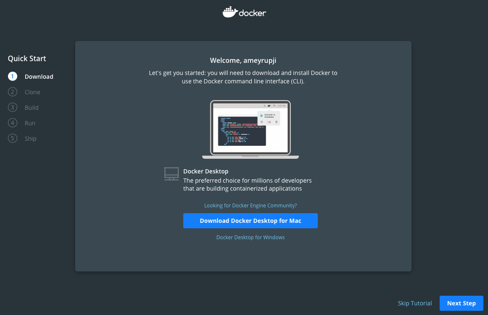
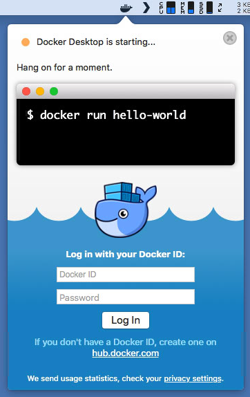
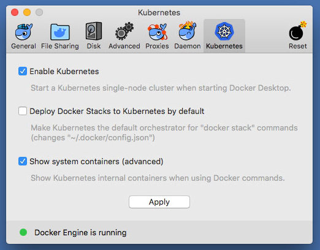
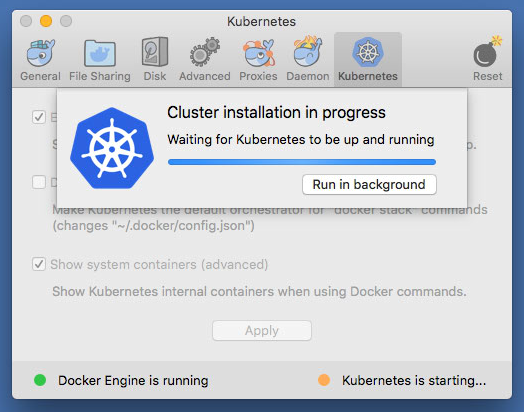

# ameyrupji.local-kubernetes-setup

This repository outlines the steps to setup nginx on MacOS to act as a reverse proxy for various apps deployed on my local server.

## Prerequisites 

- HomeBrew installed (Installation instructions: https://www.howtogeek.com/211541/homebrew-for-os-x-easily-installs-desktop-apps-and-terminal-utilities/)

## System Configuration at time of test

- macOS Mojave - Version 10.14.5
- Docker Installed

## Installation instructions

### Install Docker on MacOS

Download and install docker for MacOS from `hub.docker.com`. You will need to authenticate to be able to download the app.

Install the downloaded app and start it. It will appear in the menu bar.

Wait for the app to start once the app is started to go the `Preferences` and click on the `Kubernetes` tab and check the `Enable Kubernetes` and `Show system containers (advanced)` and click on `Apply` button.

Wait for the Kubernetes to install it should take about 5-10 min.

<!-- ## Test 

Open Safari it by going to URL:
`http://localhost`

This website should also be accessible over the network from another computer at `http://ameyrupji.local/`

## Cleanup

To uninstall nginx:

First stop the nginx server if it is running by:
`sudo nginx -s stop`

Using brew to uninstall Nginx run the command: 
`brew uninstall nginx`

Remove Nginx code by running the following commands:
`rm -f -R /usr/local/nginx` and `rm -f /usr/local/sbin/nginx` -->

## Useful Links

- https://medium.com/containermind/a-beginners-guide-to-kubernetes-7e8ca56420b6
- 