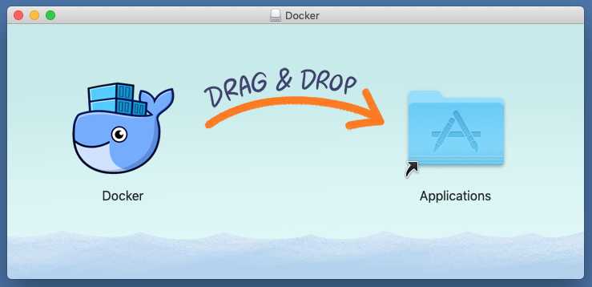

# ameyrupji.local-kubernetes-setup

This repository outlines the steps to setup nginx on MacOS to act as a reverse proxy for various apps deployed on my local server.

## Prerequisites 

- HomeBrew installed (Installation instructions: https://www.howtogeek.com/211541/homebrew-for-os-x-easily-installs-desktop-apps-and-terminal-utilities/)

## System Configuration at time of test

- macOS Mojave - Version 10.14.5
- Docker Installed

## Installation instructions

### Install Docker on MacOS

Download and install docker for MacOS from `hub.docker.com`. You will need to authenticate to be able to download the app.


Install the downloaded app and start it. It will appear in the menu bar.




Wait for the app to start once the app is started to go the `Preferences` and click on the `Kubernetes` tab and check the `Enable Kubernetes` and `Show system containers (advanced)` and click on `Apply` button.


Wait for the Kubernetes to install it should take about 5-10 min.


### Deploy official Kubernetes dashboard

We can deploy the dashboard with the following command:

`kubectl apply -f https://raw.githubusercontent.com/kubernetes/dashboard/v1.10.1/src/deploy/recommended/kubernetes-dashboard.yaml`

This should create all the necessary objects for the UI to run properly, which you can check by running `kubectl proxy`


To Verify dashboard service is running run the following command in terminal: `kubectl get services -n kube-system`


Open `http://127.0.0.1:8001/api/v1/namespaces/kube-system/services/https:kubernetes-dashboard:/proxy/` in the browser to load the dashboard.


### Enable Skip option on login page

To grant full admin privileges to Dashboard's Service Account by creating below ClusterRoleBinding run the following command.

`kubectl create -f https://raw.githubusercontent.com/ameyrupji-local/ameyrupji.local-kubernetes-setup/master/kubernetes-dashboard/dashboard-admin.yaml`

f you are using dashboard version v1.10.1 or later, you must also add `--enable-skip-login` to the deployment's command line arguments. You can do so by adding it to the args in `kubectl edit deployment/kubernetes-dashboard --namespace=kube-system`

Example edit:

```
    containers:
    - args:
      - --auto-generate-certificates
      - --enable-skip-login            # <-- add this line
      image: k8s.gcr.io/kubernetes-dashboard-amd64:v1.10.1
```

Now running `kubectl proxy` you should see the skip button on the login:

safari-kubernetes-dashboard-skip-login


### Kubernetes Dashboard Access through a proxy

Since this is deployed to our private cluster, we need to access it via a proxy. Kube-proxy is available to proxy our requests to the dashboard service. In your workspace, run the following command:

`kubectl proxy --port=9080 --address='0.0.0.0' --disable-filter=true &`


This will start the proxy, listen on port 9080, listen on all interfaces, and will disable the filtering of non-localhost requests. Lets test it out by going to the link: `http://localhost:9080/api/v1/namespaces/kube-system/services/https:kubernetes-dashboard:/proxy/#!/login`


This url should also be accessible on the local network at `http://ameyrupji.local:9080/api/v1/namespaces/kube-system/services/https:kubernetes-dashboard:/proxy/#!/login`


### Setting up Nginx

In the nginx file located at `/usr/local/etc/nginx/nginx.conf` add the following to the server listening at port `80`:

```
location /k8s/dashboard/ {
    proxy_pass              http://127.0.0.1:9080/api/v1/namespaces/kube-system/services/https:kubernetes-dashboard:/proxy/;

    proxy_set_header        Host $host;
    proxy_set_header        X-Real-IP $remote_addr;
    proxy_set_header        X-Forwarded-For $proxy_add_x_forwarded_for;
    proxy_set_header        X-Forwarded-Proto $scheme;
}
```

Restart nginx by running commands `sudo nginx -s stop` and `sudo nginx`.

### Install dashboard using Helm 

`helm install --name kubernetes-dashboard ./helm`

## Test 

Open Safari it by going to URL:
`http://localhost/k8s/dashboard`


This website should also be accessible over the network from another computer at `http://ameyrupji.local/k8s/dashboard`


**Helm** 

URL: `https://localhost:30001/`


## Cleanup

Remove Nginx code to point to dashboard that was added above.


Remove the dashboard by running the following commands:
```
kubectl delete replicasets/kubernetes-dashboard -n kube-system
kubectl delete svc/kubernetes-dashboard -n kube-system
kubectl delete deployments/kubernetes-dashboard -n kube-system
kubectl -n kube-system delete $(kubectl -n kube-system get pod -o name | grep dashboard)
```

`helm delete --purge kubernetes-dashboard`

## Useful Links

- https://medium.com/containermind/a-beginners-guide-to-kubernetes-7e8ca56420b6
- https://8gwifi.org/docs/kube-dash.jsp 
- https://stackoverflow.com/questions/46664104/how-to-sign-in-kubernetes-dashboard
- https://eksworkshop.com
- https://www.freecodecamp.org/news/learn-kubernetes-in-under-3-hours-a-detailed-guide-to-orchestrating-containers-114ff420e882/
- https://joshh.info/2018/kubernetes-dashboard-https-nodeport/
